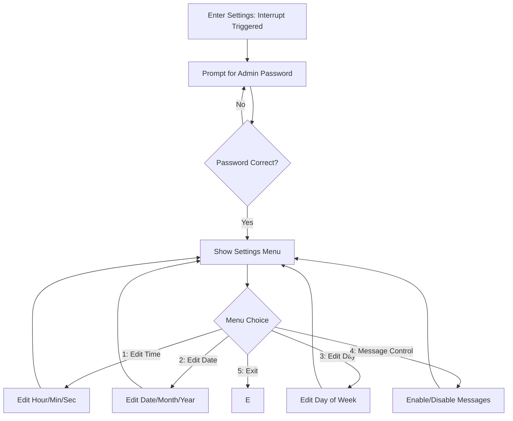

## Project Overview: Event Board Mini Project

### 1. Introduction

The Event Board Mini Project is a microcontroller-based real-time event display system using the LPC2148 ARM7 MCU. The system displays scheduled messages, current time/date, day of week, and temperature on an LCD. It allows an admin to change the schedule, time, date, and enable/disable messages through a keypad and password-protected menu.

### 2. Key Features

- **Real-time Clock (RTC):** Displays current time and date.
- **Scheduled Messages:** Scrolls important messages at preset times.
- **Temperature Display:** Reads and displays temperature from an LM35 sensor.
- **Admin Settings:** Password-protected menu to edit time, date, day, and message schedule.
- **User Interface:** 4x4 keypad for input, 16x2 LCD for output.
- **Interrupt Support:** External interrupt for quick access to settings.
- **Status Indication:** Red/Green LEDs indicate normal/message mode.

---

### 3. System Architecture

#### Main Hardware Blocks

- **LPC2148 Microcontroller**
  - Controls logic, peripherals, and interfaces
- **16x2 LCD**
  - Displays real-time information and messages
- **4x4 Matrix Keypad**
  - User/admin input for changing settings
- **LM35 Temperature Sensor**
  - Feeds analog temperature to ADC channel
- **RTC (built-in)**
  - Maintains current time/date/day
- **Status LEDs**
  - Indicate different operation modes

#### Software Modules

- **main (Event_Board_Main.c):** System initialization, main loop, message scheduling, user display
- **lcd.c / lcd.h:** LCD control and display routines
- **kpm.c / kpm.h:** Keypad interface and input routines
- **rtc.c / rtc.h:** RTC setup, time/date get/set, day display
- **adc.c / adc.h:** ADC setup, temperature reading
- **settings.c / settings.h:** Admin settings menu, password checking, time/date/message editing
- **delay.c / delay.h:** Timing utilities for delays
- **pin_connect_block.c / pin_connect_block.h:** Pin function configuration (PINSEL)
- **types.h:** Custom data types for portability

---

### 4. Project Flowchart

#### Top-Level System Flow

flowchart TD
    A[Start: Power On/Reset] --> B[Hardware Initialization (LCD, Keypad, RTC, ADC, LEDs)]
    B --> C[Set Initial Time/Date/Day]
    C --> D[Configure External Interrupt]
    D --> E[Main Loop]
    
    E --> F{Scheduled Message Time?}
    F -- Yes --> G[Display & Scroll Message<br>Turn ON Green LED, OFF Red LED]
    F -- No --> H[Show Time/Date/Day<br>Temperature<br>Turn ON Red LED, OFF Green LED]
    G --> E
    H --> E
    E --> I{EINT0 Interrupt?}
    I -- Yes --> J[Admin Settings Menu<br>(Password Protected)]
    J --> E
    I -- No --> E
#### Admin Settings Menu Flow



---

### 5. Typical Operation

- On boot, system initializes peripherals and sets initial time/date if required.
- Main loop constantly checks current RTC time.
- If a scheduled message time matches, it scrolls the message and switches LEDs.
- Otherwise, displays time, date, day, and temperature.
- User can press the settings key (EINT0) for admin menu, after entering correct password can edit time, date, day, and enable/disable messages.

---

### 6. File Structure

```
|-- Event_Board_Main.c      # Main logic and loop
|-- adc.c/h                 # ADC driver and LM35 interface
|-- delay.c/h               # Delay routines
|-- lcd.c/h                 # LCD driver
|-- kpm.c/h                 # Keypad driver
|-- rtc.c/h                 # RTC routines
|-- settings.c/h            # Admin and settings menu
|-- pin_connect_block.c/h   # Pin function configuration
|-- types.h                 # Custom types
|-- defines.h, ...          # Bitwise and project-wide macros
|-- *.d                     # Dependency files
|-- *.htm                   # Build logs, call graphs
|-- Startup.s               # MCU startup file
```

---

## 7. How to Use

1. **Compile code** and flash to LPC2148.
2. **Connect hardware**: LCD, keypad, LM35, LEDs as per your schematic.
3. **Watch for scrolling messages** at the set times, or real-time info otherwise.
4. **Press EINT0 button** to enter settings, use keypad to change time/date/day/messages.
5. **Set admin password** in code (`settings.c`).

---

## 8. Customization and Extension Ideas

- Change scheduled messages in `Event_Board_Main.c`
- Change admin password in `settings.c`
- Add buzzer or more sensors via new modules

---

## 9. Flowchart Image for README (Optional)

> 
> *(You can export the above Mermaid diagram as PNG and upload to your repo)*

---

**End of Project Overview**
